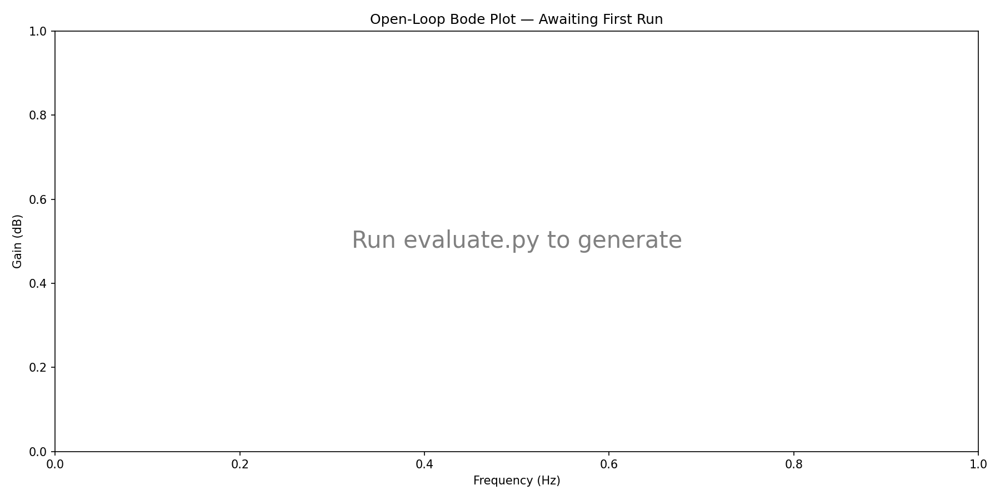
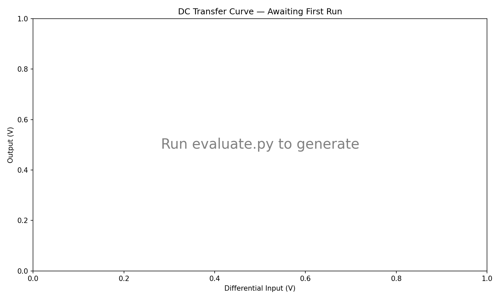

# opamp

Autonomous op-amp design using AI + Differential Evolution.

An AI agent designs circuit topologies, DE optimizes component values, ngspice simulates. The agent iterates until specs are met.

## Target: LM4562-class Audio Op-Amp

| Spec | Target | Unit |
|------|--------|------|
| DC Gain | >100 | dB |
| GBW | >10 MHz | Hz |
| Phase Margin | >60 | deg |
| Power | <500 | mW |
| Output Swing | >24 | V p-p |
| CMRR | >80 | dB |

Supply: ±15V | Load: 600Ω ∥ 100pF

## How It Works

1. AI agent chooses a circuit **topology** (netlist structure)
2. Agent defines **parametric components** with sweep ranges
3. **Differential Evolution** finds optimal parameter values
4. Agent evaluates results against specs
5. If specs aren't met → change topology → repeat

The agent never sets component values directly. It defines the search space — DE explores it.

## Results

See `results.tsv` for the experiment log. Each topology iteration includes:
- Score (0-1) against specs
- Which specs pass/fail
- Bode plot and output swing in `plots/`

## Latest Plots

### Bode Plot


### Output Swing


## Running

```bash
# Full autonomous run (DE runs until convergence)
python evaluate.py

# Quick sanity check
python evaluate.py --quick

# With remote sim server
python evaluate.py --server http://sim-node:8000
```

## Project Structure

```
design.cir        — Parametric SPICE netlist (AI edits topology)
parameters.csv    — DE sweep ranges (AI sets ranges)
evaluate.py       — Evaluator: runs DE, scores, generates plots
specs.json        — Target specifications (fixed)
program.md        — AI agent instructions (fixed)
de/               — Differential Evolution engine (pure NumPy)
plots/            — Generated simulation plots
```
